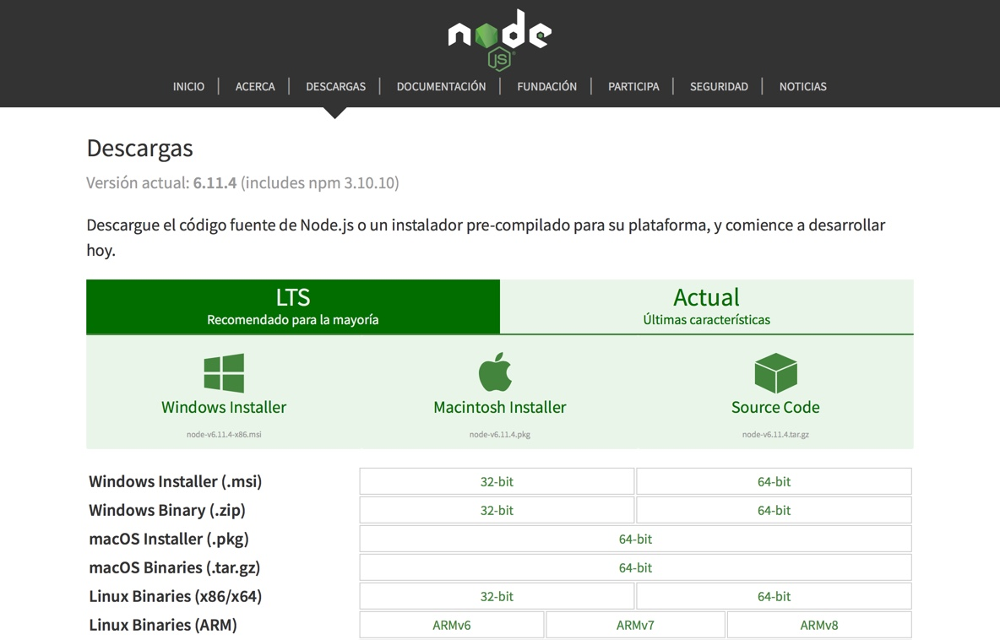
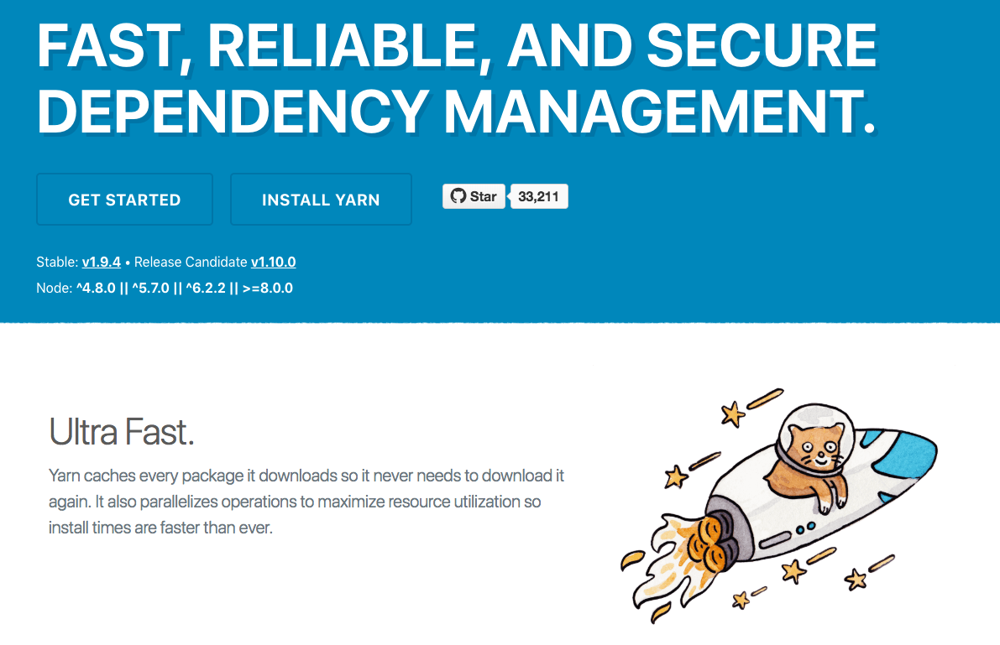

# 1. Configurando el ambiente

Antes de arrancar, se necesitan tener las herramientas instaladas. No hay restricciones con respecto al sistema operativo (_Windows, Linux o Mac_) y al browser (_Microsoft Edge, Chrome, Safari, Firefox, etc._), aunque se instalará Chrome para asegurar tener la misma experiencia en el transcurso del workshop sin depender del sistema operativo. 

Se requiere instalar _node.js_ y _npm_. Aparte de estas herramientas, se necesita un editor de texto (_Visual Studio Code, Sublime, Atom, Vim, etc._). 

A continuación, se explica cómo instalar alguna de ellas.

## Instalar Chrome última versión

El workshop se basa en estándares web que para el momento de creación del mismo no estaban completamente implementadas en todos los browsers. Por eso, más la posibilidad de tener la misma experiencia en todos los sistemas operativos, agregamos como prerrequisito tener la última versión de Chrome instalada.

1. Navegar a [https://www.google.com/chrome/](https://www.google.com/chrome/) y descargar la versión correspondiente para tu plataforma.

    

    _Sitio de Chrome_

1. Una vez descargado, seguir los pasos de la instalación.

## IDE / Editor. Ejemplo Visual Studio Code

Para editar el código, se va a aprovechar _Visual Studio Code_, en especial porque permite trabajar en todas las plataformas y es gratuito. Igualmente, se puede usar su editor de texto o IDE preferido.

1. Navegar a [https://code.visualstudio.com](https://code.visualstudio.com) y descargar la versión correspondiente para tu plataforma.

    

    _Sitio de Visual Studio Code_

1. Una vez descargado, seguir los pasos de la instalación.

## Node.js & npm

Necesitaremos un usar librerias y funciones como prender un servidor con js. asi que es un requisito usar [node.js](https://nodejs.org) y [npm](https://www.npmjs.com).

1. Navegar al sitio de descargas de _node.js_: [https://nodejs.org/es/download/](https://nodejs.org/es/download/).

    

    _Sitio de node.js_

1. Seleccionar la versión _LTS (Long term support)_ y la plataforma correspondiente.

1. Una vez descargado, seguir los pasos de la instalación.

## yarn

Yarn es una alternativa, a npm si lo tienes instalado podemos usarlo para el codelab y si no lo tienes, pues te recomiendo darle una oportunidad, aunque no es indispensable si tienes npm

1. Navegar al sitio de descargas de _yarn_: [https://yarnpkg.com/en/docs/install](https://yarnpkg.com/en/docs/install).

    

    _Sitio de yarn_

## Próximo modulo
Avanzar al [módulo 2](../02-javascript)